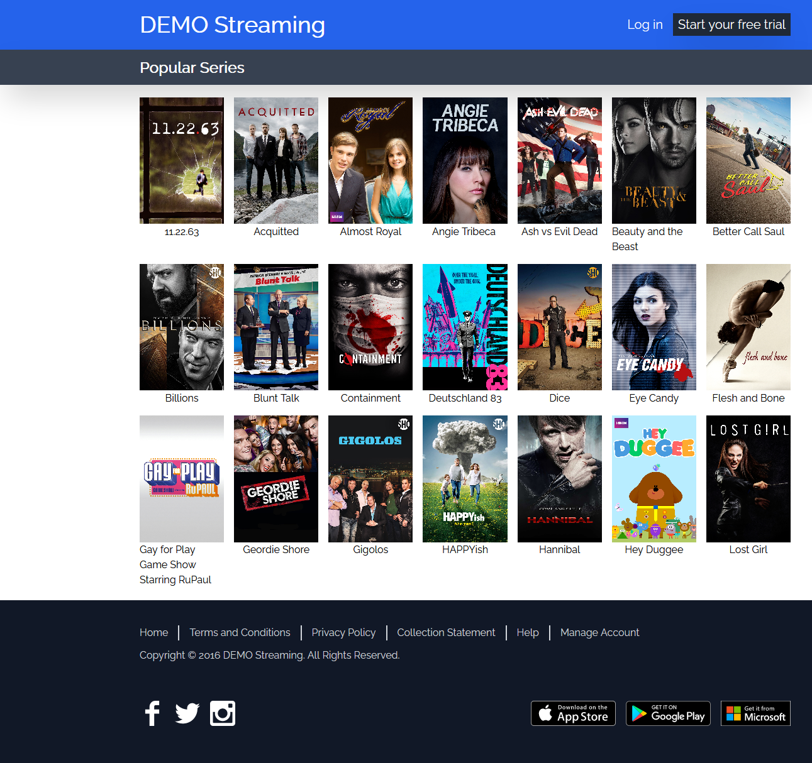

# React Movies and Series

## Description

Render movies and series in React

## Libraries used

- react-router-dom for router in react
- react-query for data fetching and caching
- Tailwindcss for styles
- msw and json-server for mock data and fake api
- react-lazy-load-image-component for image lazy loading

## How to Run

You need to run stubapi and react app on your local

### npm start / yarn start

This will run react app on your local with port:3000

### npm run stubapi / yarn run stubapi

This will run stub api on your local with port:8000

## How to Test

### npm run test / yarn run test

This will run all test cases

## How to build

### npm run build / yarn run build

## Snapshot

